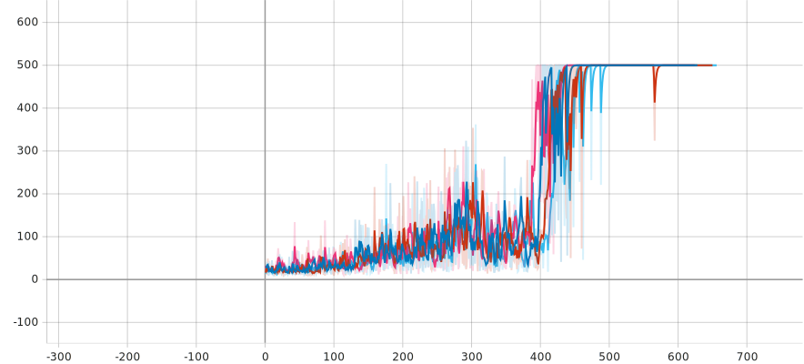

# IMPALA Implementation for CartPole-v1

This project implements the IMPALA (Importance Weighted Actor-Learner Architecture) algorithm for the CartPole-v1 environment using PyTorch. The implementation focuses on a multi-process setup but is designed with modularity to support potential distributed learning in the future.

## Project Overview

- **Algorithm**: IMPALA Reinforcement Learning
- **Environment**: CartPole-v1 (OpenAI Gym)
- **Implementation Approach**: Multi-process with potential for distributed learning



## Key Features

1. **V-trace Off-policy Correction**: Implements V-trace to correct for off-policy actions, ensuring stable and efficient learning.
2. **Actor-Learner Architecture**: Separates the concerns of acting and learning, allowing for scalable and efficient training.

## Installation

Ensure you have Python 3.7+ and install the necessary dependencies:

```bash
pip install -r dependencies/requirements.txt
```

## Run

To start training the IMPALA agent on CartPole-v1, simply run on Windows:

```bash
python main.py
```

For Linux:

```bash
python3 main.py
```

## Configuration

The `config.py` file contains various hyperparameters and settings that can be adjusted to tune the performance of the algorithm:

- `GAMMA`: Discount factor for future rewards
- `LEARNING_RATE`: Learning rate for the optimizer
- `GRAD_CLIP`: Gradient clipping threshold
- `COEF_MAX` and `RHO_MAX`: Maximum coefficients for importance sampling
- `TRAJECTORY_LENGTH`: Length of actor trajectories
- `BASELINE_LOSS_WEIGHT`: Weight for the value loss
- `ENTROPY_COST`: Coefficient for entropy regularization

## Future Improvements

- **Advanced Monitoring**: Add more comprehensive performance monitoring and logging.
- **Complex Environments**: Extend the algorithm to handle more complex environments beyond CartPole-v1.

## Acknowledgments

This implementation is inspired by the IMPALA algorithm as described in the paper "IMPALA: Scalable Distributed Deep-RL with Importance Weighted Actor-Learner Architectures" by Espeholt et al.